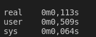
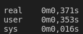

# N queens parallel implementation

## Compile

### Parallel

```
<<<<<<< HEAD
g++ src/nqueens.cpp -o build/main -fopenmp -O2
=======
g++ src/nreinasm.cpp -o build/main -fopenmp -O2
>>>>>>> a3e57d2a0931cb5b42af3577975c2aa5d911dddd
```

### NonParallel

```
g++ src/npnreinas.cpp -o build/npmain
```

## Run

### Parallel

```
time ./build/main find 12
```
```
time ./build/main all 12 
```


### NonParallel

```
time ./build/npmain 12
```

## Results

With 12 queens

Parallel



NonParallel


